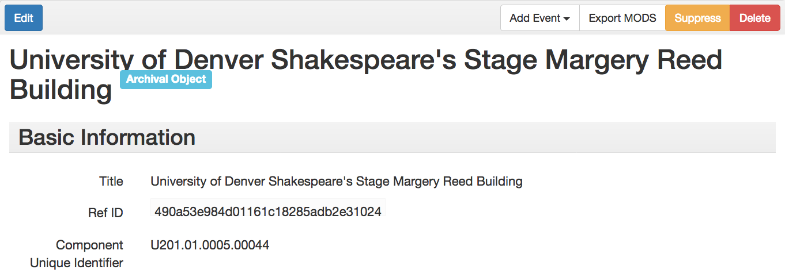
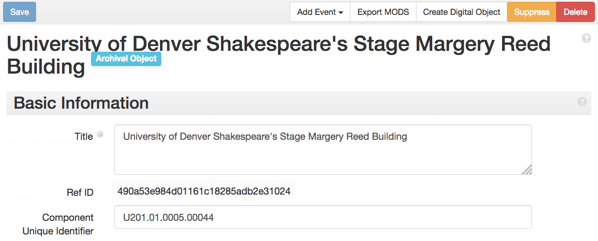
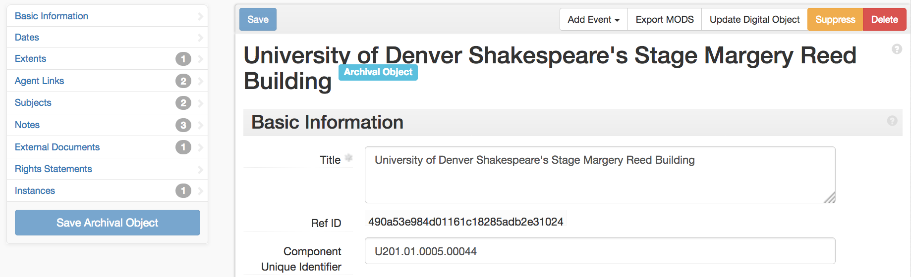
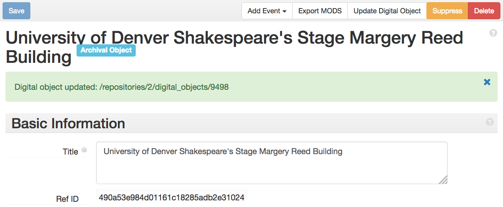

# ao_mods

This plugin allows users to download MODS representations of Archival Objects in ArchivesSpace. It does this through backend controllers allowing a MODS representation of any Archival Object record to be downloaded in the same way as a Digital Object, and using a version of the same MODS exporter/model files (re-written for the Archival Object JSON schema). On the frontend, it provides a link to export MODS records for any Archival Object with a component level of 'item' (in keeping with our local implementation of ArchivesSpace).

On the 'item_linker' branch, the plugin allows a user to create minimal digital object records for an item based on its title and component ID, and to update that digital object with the External Document link to [Special Collections @ DU](https://specialcollections.du.edu), our digital repository. This branch is written more specifically for DU's implementation of ArchivesSpace, though others may find it useful.

## Glossary of Terms

* **Item:** An Archival Object whose level of description is "Item."

## How it works

In the staff frontend interface, when the plugin is installed and activated, each item will have an "Export MODS" button in its toolbar, as seen in the screenshot below:

Clicking the button makes an API request to download a MODS representation of the metadata contained in the Archival Object record (along with a few fields from any linked representative Digital Object), as well as metadata about that MODS representation, according to the mappings found in the 'backend' directory. (One could also download the MODS directly from the backend via curl or wget, if desired.) The backend exports are derived from the existing MODS exporters for Digital Objects, remapped to ArchivesSpace's Archival Object data model.

The 'item_linker' branch allows users to create new digital objects and update identifiers of existing digital objects, in line with DU's use of digital objects as an inventory of what digital assets are managed in our repository. When the 'item_linker' branch is activated, additional buttons appear in the toolbar:

* **Create Digital Object** creates a new digital object using the item's title and component ID as the digital object's title and identifier, and will then link it to the item as its representative digital object.
* **Update Digital Object** checks to see if the item has an External Document whose title is "Special Collections @ DU" (indicating a link to the repository); if the representative digital object's identifier does not match the location of that External Document, clicking the button will update the identifier to match the Islandora link.

### Creating a new digital object from an item

### Updating an existing digital object from an item

### The finished product, with flash message indicating success

When the process is finished, the user will be returned to the item record, with a flash message indicating either success or failure of the process.

Questions may be directed to kevin.clair at du.edu.
